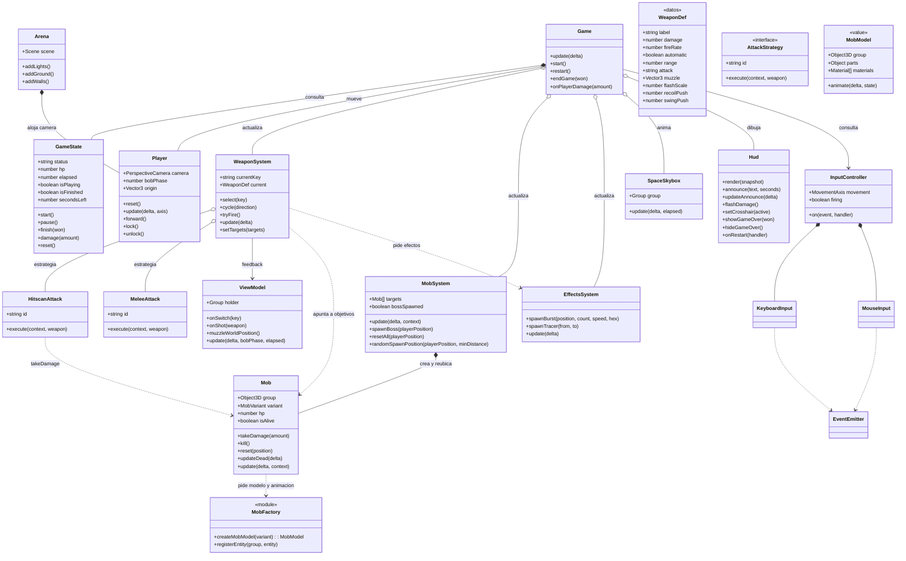
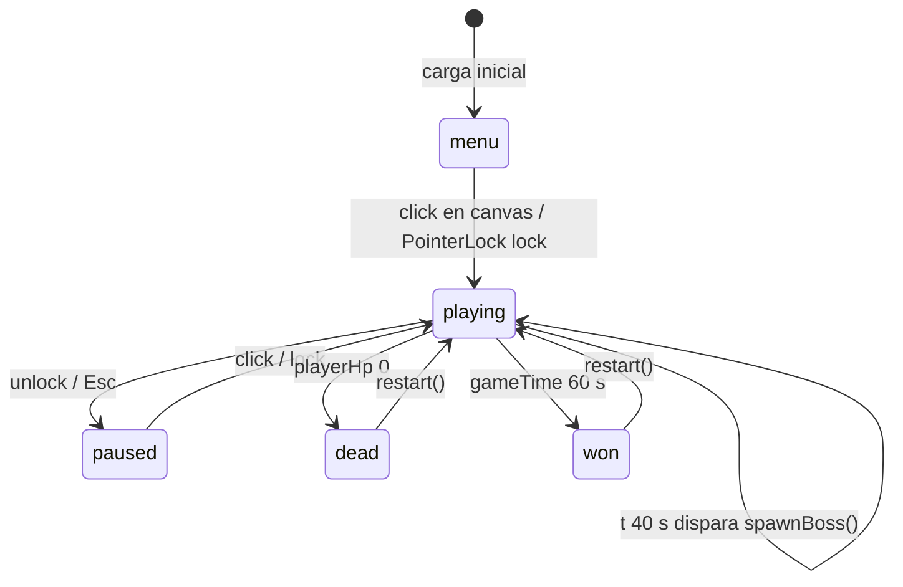
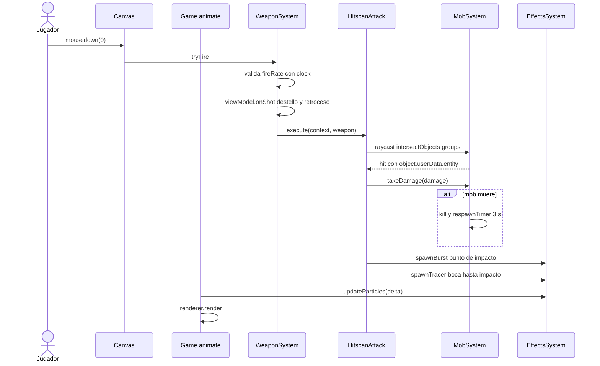
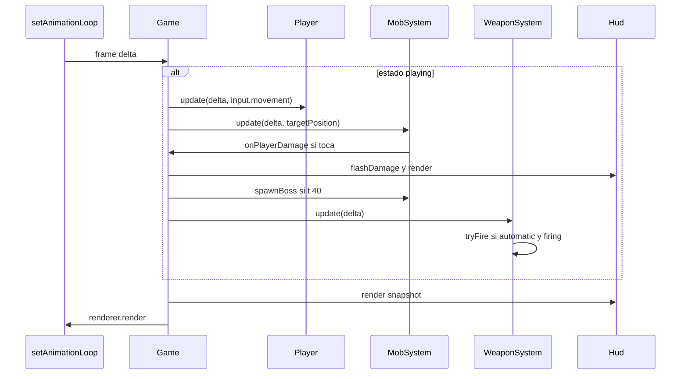
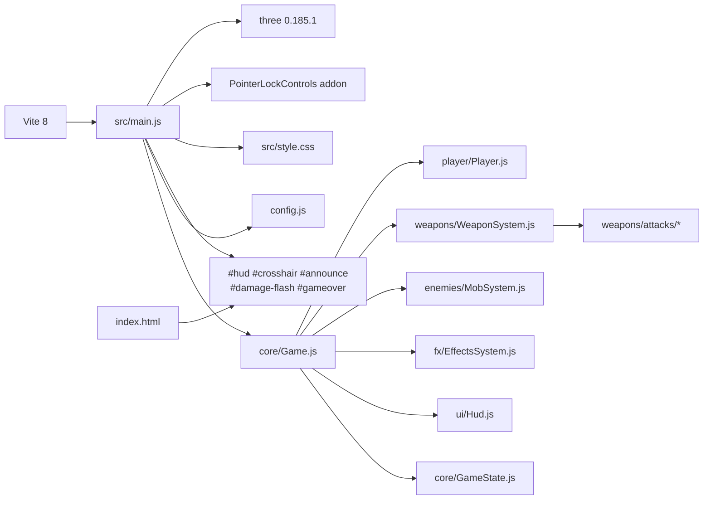

# Arquitectura

El juego esta dividido en modulos ES. Cada archivo tiene una sola
responsabilidad y `src/main.js` solo instancia y conecta (composition root).

```
src/
  main.js                    composition root: instancia y cablea
  config.js                  constantes y tunables
  contracts.js               contratos JSDoc compartidos
  core/     EventEmitter, GameState, Game
  engine/   Arena, SpaceSkybox, createRenderer
  input/    InputController, KeyboardInput, MouseInput
  player/   Player
  weapons/  WeaponCatalog, WeaponFactory, ViewModel, WeaponSystem
            attacks/ HitscanAttack, MeleeAttack
  enemies/  Mob, MobFactory, MobSystem
  fx/       EffectsSystem
  ui/       Hud
```

## 1. Como se aplica SOLID

| Principio | Donde se ve |
| --- | --- |
| SRP | `Hud` solo DOM, `Mob` solo vida e IA, `MobSystem` solo ciclo de vida, `Game` solo orden de actualizacion |
| OCP | nuevo modo de disparo = nueva clase en `weapons/attacks`; `WeaponSystem` no cambia |
| LSP | `Mob` cumple el contrato `Target`; el jefe es la misma clase con otra variante (`MOB_VARIANTS.boss`), sin subclases |
| ISP | `InputController` expone `movement`, `firing` y eventos; cada consumidor toma solo lo que usa |
| DIP | `Game` recibe subsistemas por constructor; los ataques reciben un `AttackContext`, no clases concretas |

## 2. Vista de clases



## 3. Maquina de estados de la partida



## 4. Secuencia: disparo con arma de fuego



## 5. Secuencia: ciclo de `Game.update()`



## 6. Dependencias



## Enemigos

`MobFactory` construye el modelo procedural a partir de la variante y devuelve
`{ group, parts, materials, animate }`. Cada enemigo recibe materiales propios:
compartirlos hacia que el destello de impacto de uno se viera en todos.

- Los modelos miran hacia `-Z`, por eso `Mob` calcula el yaw a mano
  (`Math.atan2(-x, -z)`) en lugar de usar `lookAt`, que apunta a `+Z`.
- `animate(delta, state)` solo mueve las piezas; la IA sigue en `Mob`, que le
  pasa `moving` y `attacking`. Las animaciones parten de una pose base, asi que
  un enemigo que se detiene vuelve a la postura.
- El brillo de los ojos se guarda al crear el enemigo y se restaura tras el
  destello y al reaparecer, de modo que no se pierde ni queda en negro.
- Las variantes normales (`soldier`, `alien`, `tank`) se reparten por turno
  entre los `MOB.count` enemigos; el jefe es siempre `boss`.

### Proporciones

Las medidas estan en metros y son deliberadas, porque un enemigo mas alto que
la camara (1.7) tapa la escena en vez de amenazar:

| modelo | alto | ancho | lectura |
| --- | --- | --- | --- |
| `soldier` | 1.78 | 0.67 | humano, el tamano de referencia |
| `alien` | 1.94 | 0.66 | el mas alto de los gruntos, delgado |
| `tank` | 1.42 | 1.23 | bajo y ancho, perfil de vehiculo |
| `boss` | 2.82 | 1.35 | imponente, por debajo de los muros (3) |

- Nada de `BoxGeometry` pelado: las placas son `RoundedBoxGeometry` para que las
  aristas cojan luz, y las extremidades son capsulas con hombro y codo.
- Las extremidades cuelgan de un grupo pivote en la cadera o el hombro, asi que
  giran desde la articulacion en vez de deslizarse desde su centro.
- El tanque es intencionadamente bajo: hay que apuntar hacia abajo para
  acertarle, y esa es su diferencia de silueta con los demas.

## Deuda tecnica

- `MobSystem.randomSpawnPosition` se prueba por parametro, pero sigue siendo
  publico: se podria dejar privado y exponer solo `resetAll`.
- El contrato de las armas es un objeto plano (`view`) con cuatro miembros en
  lugar de una clase. Es suficiente, pero no hay comprobacion de tipos.
- `main.js` conoce el orden de actualizacion a traves de `Game`, no de los
  modulos: correcto, pero sigue habiendo un unico punto que hay que leer.
- Sin sombras: el render no activa `shadowMap`, asi que `castShadow` no tiene
  efecto. Las siluetas se leen por contraste de materiales.
- `MeleeAttack` mide el cono contra el origen del enemigo (sus pies), no contra
  su centro de masa. Con un enemigo alto como el jefe hay que apuntar mas bajo
  de lo natural para acertar con el cuchillo.
- Sin pruebas en el repositorio: la verificacion se hizo con un script temporal
  de humo sobre `GameState`, `Mob`, `MobSystem`, `WeaponSystem` y los ataques.
